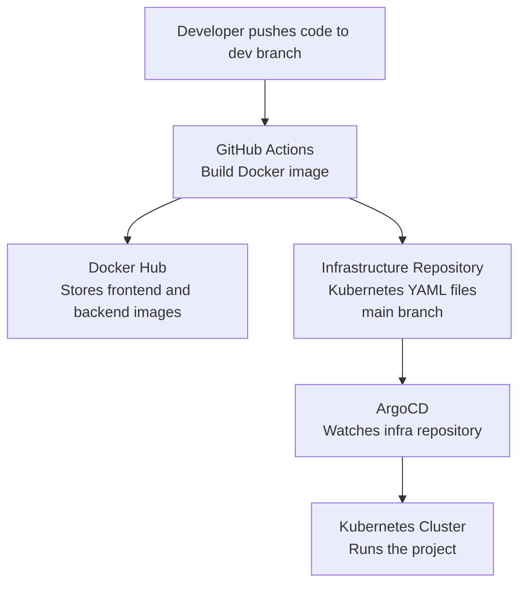
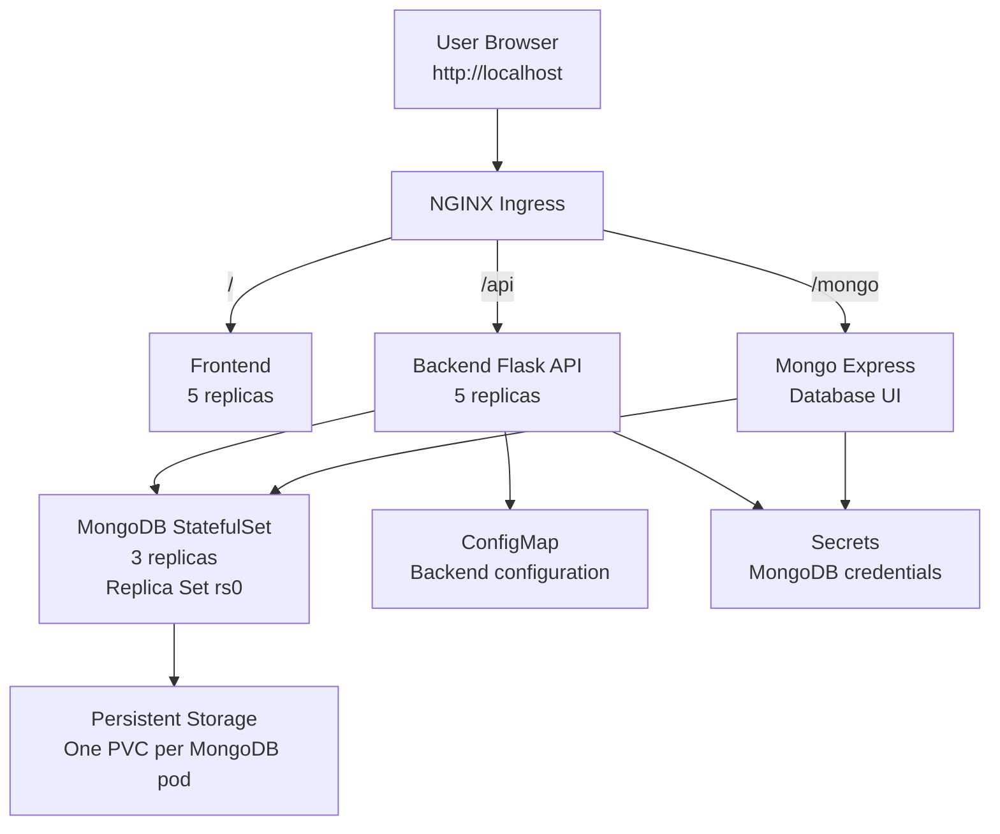
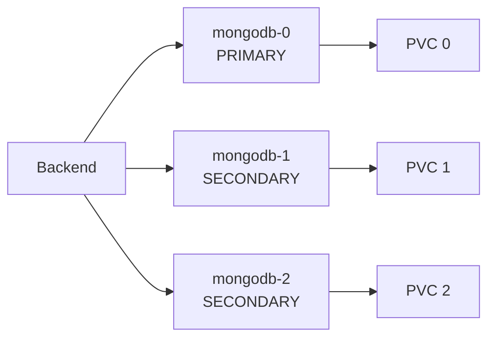

# Hotel Reservation System Architecture

This file explains the project architecture in a simple way.

The project has three main parts:

- Application code: frontend and backend repositories
- Infrastructure code: Kubernetes and ArgoCD manifests
- Kubernetes cluster: the running application

## Simple DevOps Flow

## Running Application

## MongoDB Replica Set

## Short Explanation

1. The developer pushes code to the `dev` branch.
2. GitHub Actions builds a Docker image.
3. The image is pushed to Docker Hub.
4. Pipeline 2 updates the Kubernetes image tag in the infrastructure repository.
5. The change is merged to the `main` branch of the infrastructure repository.
6. ArgoCD watches the infrastructure repository.
7. ArgoCD applies the Kubernetes manifests to the cluster.
8. The user accesses the application through `http://localhost`.

## Main Components

| Component | Purpose |
| --- | --- |
| Frontend | The HTML, CSS, and JavaScript user interface |
| Backend | The Flask API for hotels and reservations |
| MongoDB | Stores hotels and reservations |
| Mongo Express | Web UI for viewing MongoDB data |
| NGINX Ingress | Routes browser traffic to the correct service |
| Docker Hub | Stores Docker images |
| ArgoCD | Keeps Kubernetes synchronized with Git |
| ConfigMap | Stores non-secret backend configuration |
| Secret | Stores MongoDB username, password, and keyfile |
| PVC | Stores MongoDB data permanently |
