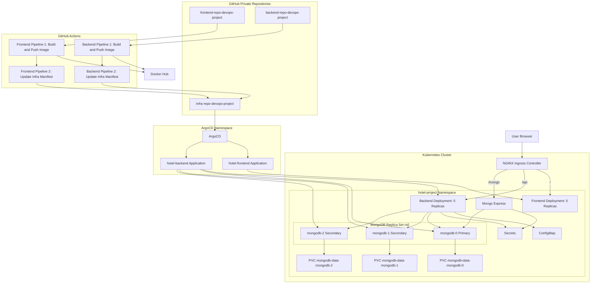

# Architecture Diagram

```mermaid
flowchart TD
    user["User Browser"]

    subgraph github["GitHub Private Repositories"]
        frontendRepo["frontend-repo-devops-project"]
        backendRepo["backend-repo-devops-project"]
        infraRepo["infra-repo-devops-project"]
    end

    subgraph actions["GitHub Actions"]
        frontendBuild["Frontend Pipeline 1: Build and Push Image"]
        backendBuild["Backend Pipeline 1: Build and Push Image"]
        frontendDeploy["Frontend Pipeline 2: Update Infra Manifest"]
        backendDeploy["Backend Pipeline 2: Update Infra Manifest"]
    end

    dockerHub["Docker Hub"]

    subgraph argocd["ArgoCD Namespace"]
        argocdServer["ArgoCD"]
        frontendApp["hotel-frontend Application"]
        backendApp["hotel-backend Application"]
    end

    subgraph cluster["Kubernetes Cluster"]
        ingress["NGINX Ingress Controller"]

        subgraph hotel["hotel-project Namespace"]
            frontend["Frontend Deployment: 5 Replicas"]
            backend["Backend Deployment: 5 Replicas"]
            mongoExpress["Mongo Express"]

            subgraph mongo["MongoDB Replica Set rs0"]
                mongo0["mongodb-0 Primary"]
                mongo1["mongodb-1 Secondary"]
                mongo2["mongodb-2 Secondary"]
            end

            configMap["ConfigMap"]
            secrets["Secrets"]
            pvc0["PVC mongodb-data-mongodb-0"]
            pvc1["PVC mongodb-data-mongodb-1"]
            pvc2["PVC mongodb-data-mongodb-2"]
        end
    end

    user --> ingress
    ingress -->|"/"| frontend
    ingress -->|"/api"| backend
    ingress -->|"/mongo"| mongoExpress

    backend --> configMap
    backend --> secrets
    backend --> mongo0
    backend --> mongo1
    backend --> mongo2

    mongoExpress --> secrets
    mongoExpress --> mongo0

    mongo0 --> pvc0
    mongo1 --> pvc1
    mongo2 --> pvc2

    frontendRepo --> frontendBuild
    backendRepo --> backendBuild
    frontendBuild --> dockerHub
    backendBuild --> dockerHub
    frontendBuild --> frontendDeploy
    backendBuild --> backendDeploy
    frontendDeploy --> infraRepo
    backendDeploy --> infraRepo

    infraRepo --> argocdServer
    argocdServer --> frontendApp
    argocdServer --> backendApp
    frontendApp --> frontend
    backendApp --> backend
    backendApp --> mongo0
    backendApp --> mongo1
    backendApp --> mongo2
```

