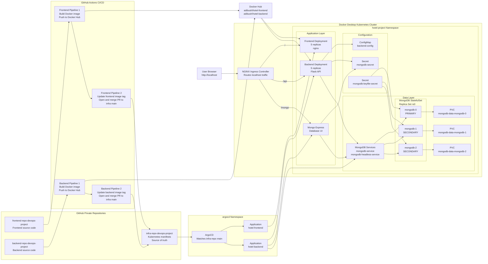

# Hotel Reservation System Architecture

This diagram shows the complete DevOps flow: source code, CI pipelines, Docker images, GitOps deployment with ArgoCD, and the running Kubernetes application.

## Flow Explanation

1. Developers push frontend or backend changes to the `dev` branch.
2. Pipeline 1 builds a Docker image and pushes it to Docker Hub.
3. Pipeline 2 updates the matching Kubernetes deployment image tag in the infrastructure repository.
4. The infrastructure repository is the GitOps source of truth.
5. ArgoCD watches the `main` branch of the infrastructure repository.
6. After a change is merged to `main`, ArgoCD automatically syncs the Kubernetes cluster.
7. Users access the system through NGINX Ingress on `http://localhost`.
8. The frontend calls the backend through `/api`.
9. The backend connects to MongoDB Replica Set `rs0`.
10. Mongo Express is available through `/mongo` for database inspection.

## Important Notes

- Frontend and backend each run with 5 replicas.
- MongoDB runs as a 3-member StatefulSet.
- Each MongoDB pod has its own PVC.
- MongoDB credentials are stored in Kubernetes Secrets.
- Backend MongoDB host and database settings are stored in a ConfigMap.
- ArgoCD manages deployments from Git and keeps the cluster synchronized.
